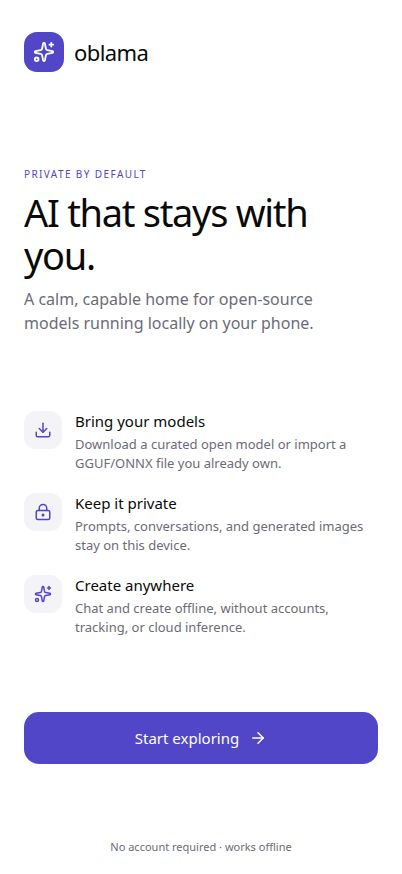

<p align="center">
  
</p>

<h1 align="center">Oblama</h1>

<p align="center">
  <strong>Private, local AI chat for your phone.</strong>
</p>

<p align="center">
  Discover, download, and chat with open AI models directly on-device.<br />
  Your conversations and model files stay local, with no account or hosted chat backend.
</p>

<p align="center">
  <a href="https://github.com/codewithmukeem/oblama/releases/latest/download/Oblama.apk">
    
  </a>
</p>

<p align="center">
  <a href="https://github.com/codewithmukeem/oblama/releases">
    
  </a>
  <a href="https://github.com/codewithmukeem/oblama/actions/workflows/android-apk.yml">
    
  </a>
  <a href="LICENSE">
    
  </a>
</p>

<p align="center">
  
</p>

<p align="center">
  <sub>Oblama onboarding — bring your models, keep your conversations private, and create anywhere.</sub>
</p>

## Overview

Oblama is a mobile-first Expo and React Native app for working with open models on your own device. It brings together model discovery, resumable downloads, private conversations, personas, custom system prompts, and local-first storage in one calm interface.

The project is intentionally transparent about its runtime boundary: the TypeScript app is ready to hand chat messages to the native `OblamaLlama` llama.cpp bridge, while Expo Go and the browser preview explain when a native inference module is required.

## What you can do

| | Capability | Details |
| --- | --- | --- |
| ◈ | **Bring your models** | Browse curated TinyLlama, Phi-3, Mistral, and SD Turbo entries; search Hugging Face; import GGUF or ONNX files. |
| ⇩ | **Manage downloads** | Pause, resume, cancel, import, and delete model files. |
| ◇ | **Chat privately** | Use personas and custom system prompts for focused conversations. |
| ↗ | **Work offline** | Keep conversations, settings, and downloaded model metadata on the device. |
| ✦ | **Use chat actions** | Copy complete responses, copy code blocks, and regenerate the latest answer. |
| ⇄ | **Keep control** | Export conversations, switch light/dark appearance, and inspect device capability checks. |

## Tech stack

| Layer | Technologies |
| --- | --- |
| Mobile app | Expo SDK 54, React Native 0.81, Expo Router |
| Language | TypeScript |
| State and persistence | Zustand, AsyncStorage |
| Model discovery | Hugging Face API, with optional token support for gated repositories |
| Inference boundary | `OblamaLlama` native llama.cpp bridge |
| Android packaging | Expo prebuild, Gradle, GitHub Actions |
| Workspace | pnpm monorepo |

## How it works

```text
┌────────────────────┐
│  Discover a model  │  Curated catalog or Hugging Face search
└─────────┬──────────┘
          │
          ▼
┌────────────────────┐
│  Download locally  │  Resumable transfer, import, pause, resume, delete
└─────────┬──────────┘
          │
          ▼
┌────────────────────┐
│  Start a chat      │  Persona, system prompt, message history
└─────────┬──────────┘
          │
          ▼
┌────────────────────┐
│  Native runtime    │  streamChat({ modelUri, messages, onToken })
└─────────┬──────────┘
          │
          ▼
┌────────────────────┐
│  Local persistence │  Conversations, settings, and model metadata
└────────────────────┘
```

The app’s runtime boundary lives in [`src/engines/llmEngine.ts`](artifacts/oblama/src/engines/llmEngine.ts). The native implementation is intentionally separate from the JavaScript UI and model-management layers.

### Native inference boundary

The Android and iOS native build must provide an `OblamaLlama` module implementing:

```ts
streamChat({
  modelUri,
  messages,
  onToken,
})
```

Expo Go and the browser preview do not contain this native module. When inference is attempted there, Oblama shows a clear native-build message rather than presenting browser JavaScript as a local llama.cpp runtime.

## Installation

### Prerequisites

- Node.js 24
- pnpm 10
- For local Android packaging: Java and the Android SDK

### Start the development app

Clone the repository and install dependencies from the workspace root:

```bash
git clone https://github.com/codewithmukeem/oblama.git
cd oblama
pnpm install
pnpm --filter @workspace/oblama run dev
```

The Replit preview uses the same Expo workflow.

### Run project checks

```bash
pnpm run typecheck
pnpm dlx expo-doctor@latest --dir artifacts/oblama
pnpm run build
```

## Android APK and releases

### Download

**[Download the latest Android APK](https://github.com/codewithmukeem/oblama/releases/latest/download/Oblama.apk)**

The current release is **Oblama v1.0.2**:

- Android version code: `3`
- Release page: [v1.0.2](https://github.com/codewithmukeem/oblama/releases/tag/v1.0.2)
- Build type: unsigned debug APK for sideloading and testing
- Package: `com.codewithmukeem.oblama`

The download button uses GitHub’s stable `releases/latest/download/Oblama.apk` URL. It is the recommended public download; Actions artifacts are retained for development and CI inspection.

### Build locally

On a machine with Java and the Android SDK installed:

```bash
cd artifacts/oblama
pnpm exec expo prebuild --platform android
cd android
./gradlew assembleDebug
```

### Automated release flow

The [Android APK workflow](.github/workflows/android-apk.yml):

1. Builds the Expo Android project with Gradle.
2. Uploads a versioned APK as an Actions artifact for development.
3. When a matching `v*` tag is pushed, publishes `Oblama.apk` to a GitHub Release only after the build succeeds.

The workflow reads the app version from [`app.json`](artifacts/oblama/app.json) and rejects a release tag that does not match it. The current release workflow uses Node 24-compatible GitHub Actions and the GitHub CLI for retry-safe release publishing.

## Privacy

Oblama is local-first by design:

- Conversations, settings, and downloaded model metadata are persisted with AsyncStorage on the device.
- Prompts and conversation history are not sent to a hosted chat backend.
- Hugging Face is accessed only for model discovery and downloads requested by the user.
- Optional Hugging Face tokens are stored securely on the device and used only for the Hugging Face requests you initiate.

Do not add secrets to source control. Use the app’s secure token storage and GitHub Actions secrets for release signing.

## Project structure

```text
artifacts/oblama/
├── app/                 # Expo Router screens
├── components/          # Reusable UI components
├── src/config/          # Model catalog and personas
├── src/engines/         # Native inference boundary
├── src/services/        # Downloads, storage, search, notifications
└── src/store/           # Persisted Zustand state
```

## Roadmap

These are the documented technical next steps for turning the current preview build into a complete production distribution:

- [ ] Provide the native `OblamaLlama` llama.cpp module in the Android and iOS native builds.
- [ ] Produce a production-signed Android release with an organization-owned keystore.

## Contributing

Contributions are welcome. Please read [`CONTRIBUTING.md`](CONTRIBUTING.md) before opening a pull request.

At a minimum:

1. Preserve the local-first behavior.
2. Keep Expo dependencies aligned with SDK 54.
3. Run `pnpm run typecheck`, `pnpm dlx expo-doctor@latest --dir artifacts/oblama`, and `pnpm run build`.
4. Call out native build or device limitations in the pull request description.

## License

Oblama is released under the [MIT License](LICENSE).